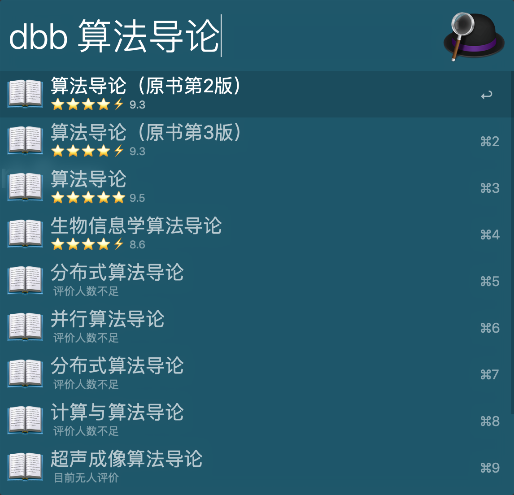
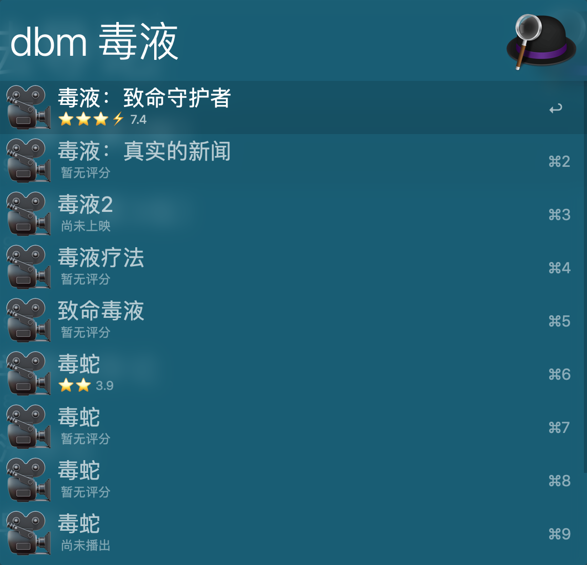
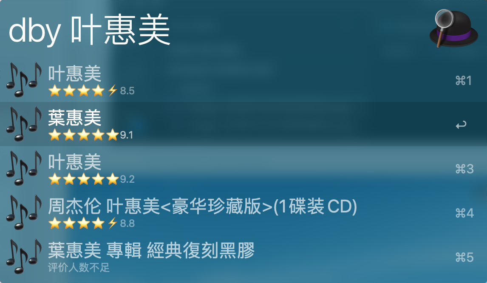

# douban-workflow

因为网上找到的大多数豆瓣的 workflow 都因为豆瓣 api 的关闭而失效，所以，自己动手，丰衣足食。

支持搜索书籍、电影和音乐。

`dbb` (douban book 简称)
`dbm`(douban movie 简称)
`dby`(douban yinyue简称，与dbm冲突，折衷)

### 安装

* [点击 douban.alfredworkflow 下载安装](https://github.com/h3l/douban-workflow/raw/master/douban.alfredworkflow)

### 实际效果如下

### 遗憾的地方

可以使用书籍、电影和音乐的缩略图代替 emoji 的图像，但是 alfred 的 workflow 默认不支持加载网络资源。so，just forget it。

### 最后

欢迎 pr。
